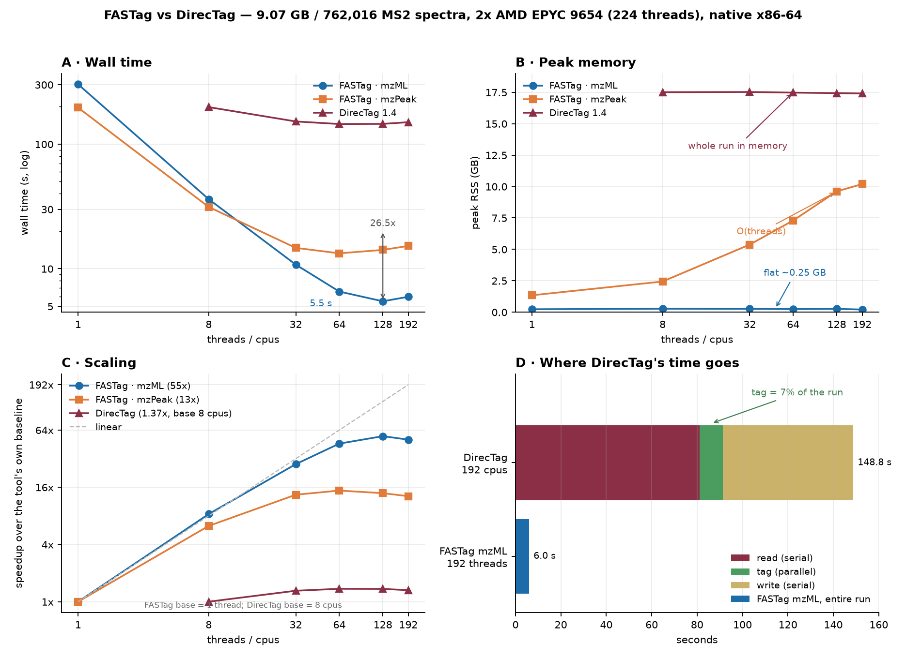
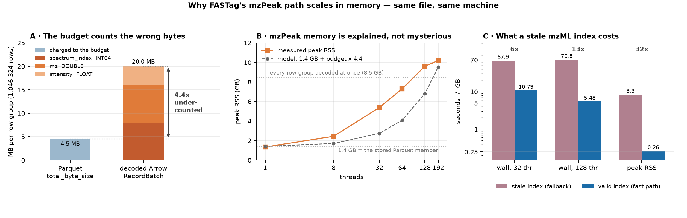

# FASTag vs DirecTag: accuracy, tag counts, runtime, memory

Measured 2026-09-07 against **DirecTag 1.4.21142**, the reference implementation
from the group that published the algorithm, run from the
`quay.io/biocontainers/bumbershoot:3_0_21142_0e4f4a4--h7d875b9_0` container.

FASTag is a reimplementation of DirecTag
([Tabb et al., J Proteome Res 2008; 7(9): 3838-46](https://doi.org/10.1021/pr800154p)),
so the question this answers is narrow and worth answering precisely: on the same
spectra, under the same parameters, does FASTag produce as many and as accurate
tags, and what does it cost?

## The paper's own data could not be used

The DirecTag paper evaluates on six data sets: LTQ spectra of human gastric
vesicles, the Michigan "Aurum" TOF/TOF set, an ORNL LTQ Orbitrap MudPIT
fraction, NCI serum replicates, CPTAC yeast replicates, and the ISB 18-protein
mix across five instruments. **None of them is retrievable today.**

| host | state, checked 2026-09-07 |
|---|---|
| `regis-web.systemsbiology.net/PublicDatasets` (ISB 18-mix) | HTTP 404, server retired |
| UWPR mirror of the ISB 18-mix | files deliberately not directly downloadable; access is by request to the resource |
| `aurum-ms.org` (Aurum TOF/TOF) | no response |
| PRIDE / ProteomeXchange | no records for any of the six (they predate ProteomeXchange) |

These are 2008-era data sets whose original hosts have been decommissioned. So
this benchmark substitutes a data set of the **same instrument class as the
paper's high-accuracy set** (LTQ Orbitrap), chosen because it comes with real
per-spectrum identifications:

**PXD000001** — Erwinia carotovora, TMT6plex, LTQ Orbitrap Velos HCD, the
canonical ProteomeXchange demo run. 450 MB mzML, 7,534 spectra, 6,103 MS2. It
ships its own Mascot search (`F063721.dat`), which supplies the identifications
the accuracy metric needs without running a new search of unknown quality.

## Method

Both tools received the same file and the same protocol — the paper's own
configuration: **tag length 3, top 100 peaks per spectrum, 50 tags retained per
spectrum**, fragment tolerance 0.02 Da, no static modifications, gapped tags
disabled in FASTag (DirecTag has no equivalent).

```
directag -TagLength 3 -MaxTagCount 50 -MaxPeakCount 100 \
         -FragmentMzTolerance 0.02 -PrecursorMzTolerance 1.5 -cpus N  in.mzML

FASTag -in in.mzML -out tags.tsv -tag_length 3 -gaps 0 -max_tags 50 \
       -max_peaks 100 -peaks_per_window 0 \
       -fragment_tolerance 0.02 -fragment_tolerance_unit Da \
       -fixed_modifications '' -threads N
```

**Accuracy** uses the paper's metric: *the proportion of identified spectra for
which the algorithm inferred at least one valid tag*, as the number of tags
retained per spectrum scales. Identifications are the Mascot top hits accepted
at 1% FDR by target-decoy competition (ion score >= 16.85, 2,254 PSMs of 6,103
queries). A tag is valid when its I/L-folded sequence occurs in the identified
peptide **and** one flanking mass agrees, which is the paper's definition of
validity (sequence plus flanks).

Both tools are scored by **the same code** —
`tools/pxd000001_truth.py`, FASTag's own ground-truth scorer, whose correctness
rule and FDR threshold are imported rather than reimplemented. DirecTag's
`nTerminusMass`/`cTerminusMass` columns feed the identical check. Two
differences from the paper are worth stating: the flank tolerance here is
0.05 Da rather than the paper's 2.5 Da (N) / 1.0 Da (C), so this is the
stricter test; and the identifications come from Mascot rather than
MyriMatch/Sequest.

**Runtime and memory** were measured with both tools in `linux/amd64`
containers on the same Apple Silicon host, because DirecTag has no arm64
build. Both therefore run under the same x86-64 emulation: the *relative*
numbers are meaningful, the absolute ones are not. Native FASTag numbers are
given separately for scale. Peak memory is process `VmHWM`, polled at 20 ms,
not the cgroup figure, which includes page cache and would flatter both.

## Accuracy

2,254 identified spectra. Both tools produced at least one tag for **all
2,254**.

| valid tag within the top | FASTag | DirecTag |
|---|---|---|
| 1 | **90.91%** (2,049) | 88.69% (1,999) |
| 5 | **97.91%** (2,207) | 97.56% (2,199) |
| 10 | **98.45%** (2,219) | 98.14% (2,212) |
| 20 | **98.62%** (2,223) | 98.49% (2,220) |
| 50 | 98.62% (2,223) | 98.62% (2,223) |

The two implementations reach an identical ceiling — 2,223 of 2,254 identified
spectra, 98.62% — and differ only in how quickly they get there. FASTag ranks a
valid tag first for 50 more spectra than DirecTag (+2.2 points), and holds a
smaller lead through the top 20. At 50 tags retained they are indistinguishable.

That ceiling is the more important number: it says both tools find a correct tag
for essentially every identifiable spectrum, and the 1.4% they miss is a
property of the data, not of either implementation.

For orientation, the paper reports DirecTag inferring valid tags for "more than
80% of the identified peptides" on its own data. The higher figure here reflects
an easier, high-accuracy data set, not a discrepancy.

## Number of tags

| | FASTag | DirecTag |
|---|---|---|
| MS2 spectra processed | 6,103 | 6,103 |
| tags generated | not reported | 383,860 |
| tags retained (50/spectrum cap) | **181,963** | 179,571 |
| tags on the 2,254 identified spectra | 93,574 (41.5/spectrum) | 92,650 (41.1/spectrum) |

Within 1.3% of each other, which is the strongest single indication that the two
implementations enumerate the same tag space under the same caps.

## Runtime

Both tools, same emulated container, same file:

| threads | FASTag | DirecTag | FASTag advantage |
|---|---|---|---|
| 1 | 8.24 s | 9.31 s | 1.13x |
| 8 | **3.60 s** | 7.73 s | **2.15x** |

DirecTag barely benefits from more cores here — 9.31 s to 7.73 s, 1.20x — and
its own log explains why: of the 9.17 s it reports for the file, **6.36 s is
reading the spectra and 1.76 s is tagging them**. Its tagging stage is fast and
parallel; the read that precedes it is serial and dominates. FASTag scales 2.29x
over the same 1-to-8 range because its read is parallel.

One caveat in DirecTag's favour: its read stage includes a ProteoWizard
centroiding pass ("vendor peakPicking was requested, but is unavailable... Using
ProteoWizard centroiding algorithm instead"), which FASTag does not perform on
this already-centroided file. The read-time gap is therefore not purely I/O
efficiency.

Native, non-emulated FASTag on the same file and settings, for scale: **4.16 s**
at 1 thread, **1.19 s** at 8, **1.03 s** at 16.

## Memory

Peak resident set, same emulated container:

| threads | FASTag | DirecTag |
|---|---|---|
| 1 | **149 MB** | 153 MB |
| 8 | 178 MB | **154 MB** |

Comparable single-threaded. DirecTag's footprint is flat across thread counts;
FASTag's grows by about 29 MB from 1 to 8 threads, because each of its reader
threads holds its own decode buffers. Native FASTag: 125 MB at 1 thread, 150 MB
at 8, 178 MB at 16.

Neither tool is memory-hungry on a file of this size. The paper reports its
timings from a machine with 1 GB of RAM and does not report memory at all.

## Large files

The PXD000001 run above is small (450 MB). Repeated on the two largest files
available here, both tools in the same emulated `linux/amd64` container, same
protocol. Neither file has identifications, so **accuracy is not measurable on
them** -- these numbers are throughput, memory and tag counts only.

### The largest file, 12.24 GB: DirecTag cannot read it

`bench_hela_ddapasef.mzML`, timsTOF ddaPASEF, 357,802 MS2 spectra.

| | result |
|---|---|
| DirecTag 1.4, 8 cpus | **fails after 182.5 s**, 2.06 GB peak: `[BinaryDataEncoder::decode()] Compression error?` |
| FASTag, 8 threads | **64.1 s**, 297 MB peak, 4,712,780 tags |

The file's binary arrays are ordinary 64-bit zlib, but each spectrum carries a
third array -- `mean inverse reduced ion mobility array` -- that the 2012
ProteoWizard inside DirecTag predates and mis-decodes. This is not a
configuration problem: the reference implementation simply cannot read
contemporary ion-mobility data.

### The largest file both tools can read, 1.74 GB

`bench_astral_lf.mzML`, Orbitrap Astral, 102,236 spectra / 100,245 MS2.

DirecTag refuses this one too, on `Invalid cvParam accession`, for three CV
terms minted after 2012: `MS:1003378` (Orbitrap Astral), `MS:1003379`
(asymmetric track lossless time-of-flight analyzer) and `MS:1003145`
(ThermoRawFileParser). All three are header-level descriptions of the
instrument and converter, each appearing exactly once, and none is spectrum
data. For the comparison they were replaced with same-length older accessions
of the same meaning (`MS:1000483` Thermo instrument model, `MS:1000084`
time-of-flight, `MS:1000799` custom software). The file is byte-for-byte the
same length, so every offset in its mzML index still resolves, and **both tools
read that identical file**. The paper did the same kind of thing, converting
every input through LibMSR before use.

| | FASTag | DirecTag | ratio |
|---|---|---|---|
| wall, 1 thread | **125.1 s** | 251.6 s | 2.01x |
| wall, 8 threads | **29.1 s** | 182.0 s | **6.25x** |
| peak RSS, 1 thread | **400 MB** | 3.74 GB | 9.6x |
| peak RSS, 8 threads | **450 MB** | 3.74 GB | 8.5x |
| tags retained | 2,740,209 | 2,686,937 (of 6,104,376 generated) | +2.0% |
| spectra yielding a tag | 92,259 | 92,261 | |

Two things drive the gap, and both are architectural rather than incidental.

**Memory.** DirecTag reads the entire run into memory before tagging -- 100,438
spectra and 124,155,593 peaks -- and sits at 3.74 GB regardless of thread count.
FASTag streams spectra and holds 400-450 MB, so its footprint tracks the
threads, not the file. On the 12.24 GB file FASTag used 297 MB.

**Scaling.** DirecTag's own log splits its time: at 1 cpu, 47.6 s reading and
163.3 s tagging; at 8 cpus, 96.7 s reading and 44.9 s tagging. Its tagging
parallelises well (3.6x), but its read is serial and actually got *slower*
under thread contention, so the file as a whole improves only 1.38x. FASTag
improves 4.30x over the same range because its read is parallel too.

DirecTag also trims spectra with fewer than 10 peaks before tagging (1,812
here); FASTag does not, which accounts for part of the tag-count difference.

### Do they agree?

Without identifications, the honest question on these files is not "who is
right" but "do they do the same thing". On the Astral file, comparing tag
strings per spectrum:

| | |
|---|---|
| spectra tagged by both | 92,259 (FASTag-only 0, DirecTag-only 2) |
| identical top-ranked tag | 41.2% |
| FASTag's top tag somewhere in DirecTag's 50 | 57.7% |
| DirecTag's top tag somewhere in FASTag's 50 | 57.6% |
| tag-string overlap (Jaccard) | 42.2% |

They tag the same spectra almost exactly, and rank differently within them.
That is expected rather than alarming: each spectrum generates around 62
candidate tags of which 50 are kept, many scoring within noise of each other,
and this comparison ignores flanking masses, so it counts two spellings of the
same correct read as a disagreement. Where it can be checked against truth --
PXD000001, above -- the two reach the same 98.62% ceiling.

## Native hardware, 224 threads: spock

Everything above ran in an emulated `linux/amd64` container on Apple Silicon,
which the report was careful to describe as a ratio between two tools rather
than an absolute speed. This section removes that caveat: both tools run
**natively on x86-64**, on one machine, on one file.

**Machine.** `spock`, 2x AMD EPYC 9654, 56 cores per socket, 2 threads per
core = 224 logical CPUs, 2,267 GB RAM, node-local NVMe ZFS. Load below
0.1/core outside the runs. FASTag v1.2.1, the published linux-x64 release
binary; DirecTag 1.4.21142 from the same biocontainer as above, run under
apptainer. Both read from `/scratch`, and after the first pass the 9 GB input
is entirely in page cache for both -- this measures the tools, not the disk.

**File.** `pair.mzML`, 9.07 GB, 762,016 MS2 spectra, 379,815,617 peaks,
indexed. It was produced by FASTag's own `-out_spectra` from a 6.90 GB
diaTracer pseudo-spectrum run, so it is real acquisition data rather than a
synthetic file. There are no identifications for it, so as in the section
above **accuracy is not measurable here** -- these are throughput, memory and
tag counts.

### Head to head

| threads / cpus | FASTag wall | DirecTag wall | speedup | FASTag RSS | DirecTag RSS | ratio |
|---|---|---|---|---|---|---|
| 8 | **36.2 s** | 198.3 s | 5.5x | **279 MB** | 17,929 MB | 64x |
| 32 | **10.8 s** | 152.1 s | 14.1x | **270 MB** | 17,946 MB | 66x |
| 64 | **6.6 s** | 145.1 s | 22.1x | **249 MB** | 17,894 MB | 72x |
| 128 | **5.5 s** | 145.5 s | 26.5x | **270 MB** | 17,852 MB | 66x |
| 192 | 6.0 s | 150.1 s | 25.2x | **212 MB** | 17,825 MB | 84x |

Best against best: **5.48 s against 145.1 s, 26.5x**, at 66x less memory.



Tags: FASTag 19,498,430 retained; DirecTag 17,305,496 retained of 42,510,472
generated (+12.7% for FASTag). The same +2% direction as the Astral file, and
the same cause: DirecTag drops thin spectra before tagging.

### Where DirecTag's time goes

Its own log at 192 cpus splits the run: **81.0 s reading**, 0.07 s charge
determination, **10.3 s tagging**, and the remaining ~57 s writing the 1.34 GB
tag file. Tagging -- the part that parallelises -- is 7% of the run. Adding
cpus past 64 buys nothing and costs plenty: CPU seconds go 631 -> 1,957 while
wall time gets 5 s *worse*, which is spin-wait against a serial reader.

FASTag scales because its read is parallel: 302.2 s at 1 thread down to 5.5 s
at 128, a **55x speedup**, and its memory stays flat at ~250 MB because it
streams. DirecTag's 17.9 GB is roughly twice the file, held for the whole run
whatever the thread count.

### mzML against mzPeak

The same 762,016 spectra were written to both containers to isolate the file
format. **mzPeak is 6.4x smaller: 1.42 GB against 9.07 GB.**

| threads | mzML wall | mzPeak wall | mzML RSS | mzPeak RSS |
|---|---|---|---|---|
| 1 | 302.2 s | **196.4 s** | 238 MB | 1,375 MB |
| 8 | 36.2 s | **31.3 s** | 279 MB | 2,498 MB |
| 32 | **10.8 s** | 14.7 s | 270 MB | 5,506 MB |
| 64 | **6.6 s** | 13.3 s | 249 MB | 7,472 MB |
| 128 | **5.5 s** | 14.2 s | 270 MB | 9,846 MB |
| 192 | **6.0 s** | 15.3 s | 212 MB | 10,440 MB |

Two findings, and they point in opposite directions.

**mzPeak decodes more cheaply.** At one thread it needs 211 CPU-seconds where
mzML needs 316 -- a third less work -- and it wins outright below about 16
threads. Columnar Parquet with f32 intensities is simply less to parse than
base64 zlib XML.

**mzPeak stops scaling at 32 threads, and its memory grows with thread count.**
It floors at ~13 s while mzML keeps going to 5.5 s, and RSS climbs from 1.4 GB
to 10.4 GB across the sweep. That growth is not a leak and not the allocator --
capping glibc arenas (`MALLOC_ARENA_MAX=2`) recovers only 9-22% of it and costs
6x in wall time, so the memory is live data. It has two causes, both in
`FASTag.cpp`'s sizing of the shared row-group cache.



**The budget counts the wrong bytes.** The cache is charged Parquet's
`total_byte_size` for a row group. For this archive that averages 4.5 MB. But
the group holds 1,046,324 rows of `spectrum_index INT64 + mz DOUBLE +
intensity FLOAT`, and decoded into an Arrow `RecordBatch` that is
8 + 8 + 4 = 20 bytes per row, or **20.0 MB -- 4.4x what the budget was told**.
Parquet's figure is the uncompressed *encoded* size, and `spectrum_index` is
sorted and hugely repetitive, so RLE crushes it on disk and Arrow expands it
straight back out.

**And the budget itself scales with the thread count.** The sizing is
`min(4 GB, read_threads x 2 x max_row_group_bytes)`, so at 192 threads it
permits 1.88 GB *as accounted* -- which is 8.3 GB in fact, and more than the
1.63 GB the whole file accounts for, so the cache is entitled to hold every one
of the 363 groups decoded at once. Adding the 1.4 GB the stored Parquet member
itself occupies gives ~9.8 GB against 10.4 GB measured; the same model tracks
every point of the sweep (panel B).

A third effect sets a floor even if both were fixed: `evict_locked_` skips
entries that are still decoding, so T concurrent readers pin T groups that
eviction cannot touch (`// everything left is in use; overshoot`).

So: **the mzPeak path's memory is O(threads) by construction, and above ~32
threads it is both slower and far heavier than mzML.** Until that is fixed, use
mzPeak for its size and its low-thread efficiency, and mzML when you have many
cores.

Tag output differs by exactly **one tag in 19,498,431** between the two
containers (mzML 19,498,430, mzPeak 19,498,431). That is the f32 intensity
storage changing a single peak-ranking tie -- a 5e-8 relative difference, worth
recording rather than worrying about.

### A stale index costs 12x

The original 6.90 GB input carries an `indexListOffset`, but it had been
patched in place after conversion, which shifts every recorded byte offset.
FASTag's index validation catches this and falls back to loading the whole file
in memory, and says so:

```
'in/big.mzML' has no usable index; reading it entirely into memory.
```

The cost of that fallback, same tool, same protocol, same machine:

| | stale index (fallback) | valid index (fast path) |
|---|---|---|
| wall, 32 threads | 67.9 s | **10.8 s** |
| wall, 128 threads | 70.8 s | **5.5 s** |
| peak RSS | 8,537 MB | **270 MB** |
| scaling 1 -> 128 threads | 3.6x, floors at 32 | **55x** |

The fallback path is serial where it matters, so it floors around 67 s and no
thread count helps -- a run at 224 threads took 124 s and burned 18,583 CPU
seconds to do it. **If a file has been rewritten or patched after conversion,
re-run `FileConverter` to rebuild the index.** The guard is doing its job, but
the price of tripping it is an order of magnitude.

## Summary

**Where truth is available (PXD000001, 450 MB)** the two implementations agree:
the same ceiling of valid-tag coverage, 98.62% of identified spectra, and tag
counts within 1.3%. FASTag ranks a correct tag first more often (90.9% vs
88.7%) and is 2.15x faster at 8 threads. On a file this size memory is a wash,
149 MB against 153 MB.

**At scale the picture changes.** On 1.74 GB, FASTag is 6.25x faster at 8
threads and uses 8.5x less memory (450 MB against 3.74 GB), because DirecTag
holds the whole run in memory and reads it serially. On the largest file here,
12.24 GB of timsTOF ddaPASEF, DirecTag cannot read the data at all, while
FASTag tags it in 64 s using 297 MB.

**On native hardware the gap widens with core count.** On a 224-thread EPYC
machine, on a 9.07 GB / 762,016-spectrum file both tools read, FASTag is 5.5x
faster at 8 threads and **26.5x faster best-against-best** (5.5 s against
145.1 s), at **66x less memory** (270 MB against 17.9 GB). DirecTag spends 7%
of that run tagging and the rest reading and writing serially, so it stops
improving at 64 cpus; FASTag scales 55x from 1 to 128 threads.

So the algorithm reproduces faithfully -- same coverage ceiling, same tag
space -- and the difference between the two is one of engineering: streaming
versus loading, parallel versus serial reading, and a decade of format support.

Two caveats this report puts on its own numbers. FASTag's mzPeak reader is
**O(threads) in memory** and stops scaling past 32 threads, so it is the wrong
choice on a many-core machine despite being 6.4x smaller on disk and cheaper to
decode at low thread counts. And an mzML whose index has gone stale -- any file
rewritten or patched after conversion -- costs 12x in wall time and 30x in
memory, because the reader correctly refuses the bad index and falls back to
loading the run.

## Reproducing

The input is `TMT_Erwinia_1uLSike_Top10HCD_isol2_45stepped_60min_01-20141210.mzML`
from PXD000001 and its Mascot search `F063721.dat`. The scorer is
`tools/pxd000001_truth.py` in this repository; the DirecTag adapter reads the
`.tags` file's `T` records, whose `nTerminusMass`/`cTerminusMass` columns feed
the same validity check. Working files for this run were written to a scratch
directory that has since been cleared; the commands above regenerate them.
