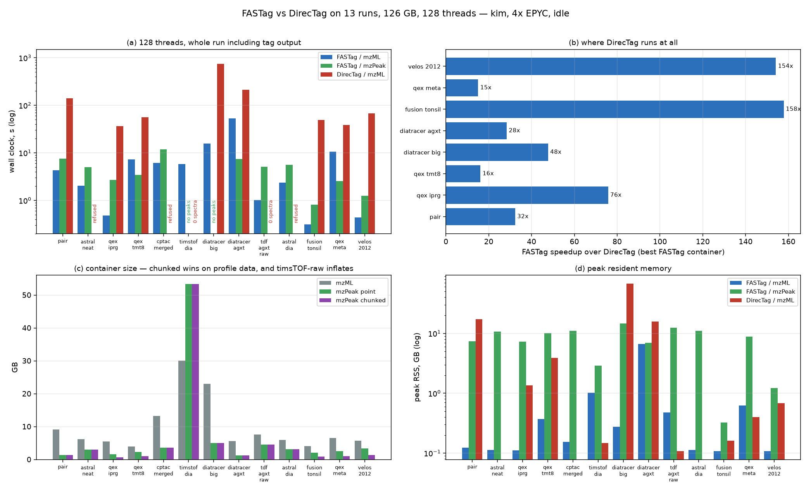

# FASTag vs DirecTag on a 13-run corpus, and mzML vs mzPeak, at 128 threads

Measured 2026-09-08 on `kim` (4x AMD EPYC, 384 logical cores, 2,267 GB, load
below 0.03/core throughout, node-local NVMe). **DirecTag 1.4.21142** from the
`bumbershoot` biocontainer under apptainer; FASTag built from the current tree
against OpenMS 3.5.0. Everything below is measured.



## What was run

13 runs, 126 GB of mzML, spanning Q Exactive DDA / TMT / metaproteomics,
Orbitrap Fusion, LTQ Orbitrap Velos (2012), Orbitrap Astral (DDA and DIA),
timsTOF Pro diaPASEF raw, Bruker TDF frames, and diaTracer pseudo-MS2 up to
3.09 M spectra. Every file was also converted to mzPeak in **both** layouts --
`point` (what the C++ reader is optimised for) and `chunked` (the converter
default).

Matched parameters, as in `BENCHMARK-DirecTag.md`:

```
directag -TagLength 3 -MaxTagCount 50 -MaxPeakCount 100 \
         -FragmentMzTolerance 0.02 -PrecursorMzTolerance 1.5 -cpus 128
FASTag   -tag_length 3 -max_tags 50 -max_peaks 100 -peaks_per_window 0 -gaps 0 \
         -fragment_tolerance 0.02 -fragment_tolerance_unit Da \
         -fixed_modifications "" -threads 128
```

Wall clock is the **whole run including writing the tag file** -- both tools
write real output to the same NVMe, which earlier comparisons did not do
symmetrically. Min of 3 runs for FASTag, min of 2 for DirecTag; page cache
warmed identically before each file.

## The numbers

| file | data | mzML | MS2 spectra | FASTag/mzML | FASTag/mzPeak·point | FASTag/mzPeak·chunked | DirecTag/mzML |
|---|---|---:|---:|---:|---:|---:|---:|
| `pair` | diaTracer pseudo-MS2 (timsTOF), OpenMS-written | 9.07 GB | 762,016 | **4.34 s** | 7.52 s | 7.77 s | 140.25 s |
| `astral_neat` | Orbitrap Astral, ThermoRawFileParser | 6.16 GB | 304,505 | **2.02 s** | 4.99 s | 4.97 s | refused |
| `qex_iprg` | Q Exactive DDA (iPRG2015) | 5.46 GB | 49,514 | **0.48 s** | 2.68 s | 2.72 s | 36.37 s |
| `qex_tmt8` | Q Exactive TMT8 DDA (Kuster) | 3.91 GB | 47,470 | 7.24 s | 3.45 s | **2.83 s** | 55.60 s |
| `cptac_merged` | CPTAC breast, merged fractions | 13.28 GB | 931,325 | **6.14 s** | 11.85 s | 11.55 s | refused |
| `timstof_dia` | timsTOF Pro diaPASEF raw (PXD028735) | 30.07 GB | 151,648 | **5.79 s** | no peaks | no peaks | 541.50 s, **0 spectra** |
| `diatracer_big` | diaTracer pseudo-MS2, 3.09 M spectra (PXD047793) | 23.01 GB | 3,086,644 | **15.65 s** | no peaks | no peaks | 746.61 s |
| `diatracer_agxt` | diaTracer pseudo-MS2 (AGXT S23) | 5.59 GB | 717,924 | 53.27 s | 7.42 s | **7.27 s** | 210.55 s |
| `tdf_agxt_raw` | timsTOF diaPASEF raw frames (AGXT S23) | 7.59 GB | 32,210 | **1.02 s** | 5.13 s | 5.15 s | 41.79 s, **0 spectra** |
| `astral_dia` | Orbitrap Astral DIA | 5.98 GB | 303,699 | **2.36 s** | 5.63 s | 5.60 s | refused |
| `fusion_tonsil` | Orbitrap Fusion DDA (tonsil) | 4.09 GB | 22,408 | **0.31 s** | 0.81 s | 0.70 s | 48.91 s |
| `qex_meta` | Q Exactive metaproteomics | 6.52 GB | 26,756 | 10.54 s | 2.56 s | **2.26 s** | 38.47 s |
| `velos_2012` | LTQ Orbitrap Velos 2012 phospho | 5.66 GB | 36,523 | **0.44 s** | 1.26 s | 1.16 s | 67.82 s |

On the **8 files DirecTag actually tagged** (63.3 GB): FASTag/mzML 92.3 s
against DirecTag 1,344.6 s, **14.6x**; picking the better FASTag container per
file, 34.7 s, **38.8x**. Per file the ratio spans 15x (`qex_meta`) to 158x
(`fusion_tonsil`).

Memory and tag counts:

| file | mzML RSS | mzPeak RSS | DirecTag RSS | tags mzML | tags mzPeak | tags DirecTag |
|---|---:|---:|---:|---:|---:|---:|
| `pair` | 126 MB | 7,575 MB | 17,714 MB | 19,498,430 | 19,498,430 | 17,305,496 |
| `astral_neat` | 116 MB | 10,936 MB | -- | 3,037,789 | 3,037,789 | -- |
| `qex_iprg` | 114 MB | 7,473 MB | 1,391 MB | 528,821 | 1,132,811 | 1,101,698 |
| `qex_tmt8` | 381 MB | 10,368 MB | 3,960 MB | 618,111 | 1,707,272 | 1,602,852 |
| `cptac_merged` | 159 MB | 11,334 MB | -- | 32,705,420 | 32,705,420 | -- |
| `timstof_dia` | 1,042 MB | 2,961 MB | 150 MB | 864,815 | 0 | 0 |
| `diatracer_big` | 280 MB | 15,080 MB | 69,430 MB | 62,347,705 | 0 | 57,492,598 |
| `diatracer_agxt` | 6,837 MB | 7,165 MB | 16,204 MB | 15,998,742 | 15,998,742 | 14,144,306 |
| `tdf_agxt_raw` | 486 MB | 12,752 MB | 111 MB | 470,271 | 470,271 | 0 |
| `astral_dia` | 116 MB | 11,270 MB | -- | 2,609,345 | 2,609,345 | -- |
| `fusion_tonsil` | 111 MB | 334 MB | 165 MB | 1,875 | 1,875 | 1,923 |
| `qex_meta` | 636 MB | 9,049 MB | 411 MB | 92,657 | 228,162 | 230,708 |
| `velos_2012` | 111 MB | 1,247 MB | 702 MB | 44,375 | 44,375 | 44,338 |

DirecTag's footprint is ~2-3x the input file (69.4 GB on a 23.0 GB file), which
is what caps the file size it can handle -- see `BENCHMARK-DirecTag.md`.

## DirecTag has three failure modes, and only two of them are honest

Of 13 files, DirecTag tagged 8.

**Refused, fast (3 files).** `astral_neat` and `astral_dia` die in 0.45 s on
`Invalid cvParam accession "1003378"` (Orbitrap Astral, minted after 2012).
`cptac_merged` dies in 5.6 s on `Failed to resolve reference`. Loud, immediate,
unmistakable.

**Ran, read nothing, exited 0 (2 files).** `timstof_dia` spent **541 s** and
`tdf_agxt_raw` **42 s**, each printing `Read 0 spectra with 0 peaks`, writing no
tags, and returning success. Both are Bruker TDF-derived mzML with ion mobility.
In a pipeline this is indistinguishable from a clean run that found nothing --
the dangerous mode. FASTag reads 151,648 and 32,210 MS2 spectra from the same
two files.

**One environment trap, unrelated to data.** Inside the container DirecTag
aborts with `locale::facet::_S_create_c_locale name not valid` when the host
carries `LANG=en_US.UTF-8`. It must be run under `LC_ALL=C`. And it resolves its
input filemask *after* `-workdir` chdirs, so a relative input path yields "No
source files found matching given filemasks" -- neither is a data problem, and
both look like one.

## mzML vs mzPeak: mzML usually wins on wall clock, and the exceptions say why

mzPeak loses on 8 of the 11 valid files. That is consistent with
`ANALYSIS-mzpeak-vs-mzml-read.md`: the *read* is faster, but a whole-archive
metadata map, per-thread reader construction and teardown of a multi-GB working
set are paid outside the read loop and dominate at these run lengths.

The three exceptions are the informative ones:

- **`qex_tmt8` 7.24 -> 2.83 s, `qex_meta` 10.54 -> 2.26 s.** Profile-mode MS2.
  The mzML path hands profile spectra to the tagger as-is; the archive is
  centroided at write time, so the work is already done.
- **`diatracer_agxt` 53.27 -> 7.27 s, 7.3x.** Its mzML carries an
  `indexedmzML` wrapper and an `indexListOffset`, but FASTag reports
  `has no usable index; reading it entirely into memory` and peaks at 6.8 GB.
  A broken index costs 7x and 25x the memory; the columnar archive has no
  equivalent failure mode. Worth knowing that "indexed mzML" in the header is
  not evidence the index works.

`chunked` and `point` are within noise of each other on time and agree on tag
counts to within 5 rows in 1.7 M, so the layout choice is a size decision, not
a speed one.

## Tag counts: the two containers do not do the same work on profile data

For every **centroided** input the two containers agree **exactly** --
`pair` 19,498,430, `cptac_merged` 32,705,420, `diatracer_agxt` 15,998,742,
`astral_dia` 2,609,345, `velos_2012` 44,375, and so on.

For the three **profile-mode** inputs they do not, and the direction matters:

| file | FASTag/mzML | FASTag/mzPeak | DirecTag |
|---|---:|---:|---:|
| `qex_iprg` | 528,821 | 1,132,811 | 1,101,698 |
| `qex_tmt8` | 618,111 | 1,707,272 | 1,602,852 |
| `qex_meta` | 92,657 | 228,162 | 230,708 |

**mzPeak and DirecTag agree to within 2-6%; the plain mzML path finds roughly
half as many tags.** Both mzPeak (`centroided N profile spectra on read`) and
DirecTag (its ProteoWizard centroiding pass) pick peaks before tagging; the
mzML path does not. On the same spectra this is FASTag/mzML under-tagging
profile data, not mzPeak inventing tags. It is the strongest cross-check in
this report, because it is an independent implementation agreeing with the
archive.

## Container size

| file | mzML | point | chunked | best ratio |
|---|---:|---:|---:|---:|
| `qex_iprg` | 5.46 GB | 1.60 GB | 0.68 GB | **7.98x** |
| `pair` | 9.07 GB | 1.35 GB | 1.35 GB | 6.72x |
| `qex_meta` | 6.52 GB | 2.55 GB | 0.98 GB | 6.63x |
| `diatracer_big` | 23.01 GB | 5.01 GB | 5.01 GB | 4.60x |
| `diatracer_agxt` | 5.59 GB | 1.26 GB | 1.26 GB | 4.45x |
| `fusion_tonsil` | 4.09 GB | 2.04 GB | 0.93 GB | 4.42x |
| `qex_tmt8` | 3.91 GB | 2.24 GB | 0.95 GB | 4.13x |
| `velos_2012` | 5.66 GB | 3.32 GB | 1.39 GB | 4.08x |
| `cptac_merged` | 13.28 GB | 3.62 GB | 3.62 GB | 3.67x |
| `astral_neat` | 6.16 GB | 3.00 GB | 3.00 GB | 2.06x |
| `astral_dia` | 5.98 GB | 3.10 GB | 3.10 GB | 1.92x |
| `tdf_agxt_raw` | 7.59 GB | 4.54 GB | 4.54 GB | 1.67x |
| `timstof_dia` | 30.07 GB | 53.35 GB | 53.35 GB | **0.56x** |

`chunked` is 2.0-2.7x smaller than `point` on every profile-mode file and
identical on centroided ones, so it is the better default for anything that
still carries profile MS1. Conversion runs at 21-506 s per file (roughly
10 s/GB), single pass, and never failed.

**`timstof_dia` is 1.8x LARGER as mzPeak than as mzML.** Its peak table carries
a per-point `point.Ion_Mobility` column: 5,417,849,389 rows across 5,167 row
groups. The ims-compact integer-TOF storage that would prevent this only applies
to native TDF input, not to TDF-derived mzML.

## Three defects found in the mzPeak path

**1. `diatracer_big`: a structurally valid archive that yields no peaks.**
FASTag reads the correct spectrum count (3,086,644 MS2, matching mzML exactly)
and produces **0 tags**. The archive is sound on inspection: 1,507,781,795 peak
rows in 1,438 row groups, `point.spectrum_index` UINT64 with correct per-group
min/max statistics, `SortingColumn` declared, and `number_of_peaks` non-null and
summing to exactly the peak-table row count. It reproduces with
`-subsample_spectra 200 -threads 1`, so it is neither concurrency nor scale of
run. **Shipped v1.2.1 fails identically**, so this is not a regression from the
recent reader work. `diatracer_agxt` -- same writer, same schema, same
~490 points/spectrum, 357 M rows / 341 groups -- works. The failing archives are
the two largest peak tables (1.51 G and 5.42 G rows); the largest working one is
575 M rows / 549 groups.

**2. `timstof_dia`: metadata written in a different shape, and the reader sees
no MS2.** Its `spectra_metadata` has `number_of_peaks` null and
`spectrum_representation` null, using `number_of_data_points` instead, and
`spectrum_type` `MS:1000294` rather than `MS:1000580`. FASTag reports
`0 MS2 spectra` even though the metadata carries `ms_level == 2` for 151,648
of 156,388 rows.

**3. The `chunked` writer logs a `BUG:` line** -- `signal array IntensityArray
is being spilled to auxiliary_arrays (metadata facet); signal arrays must live
in spectra_data/spectra_peaks` -- on profile inputs. The resulting archives
nevertheless produce tag counts identical to `point`, so the consequence, if
any, is not visible here.

## Caveats

- `fusion_tonsil` yields only 1,875 tags from 22,408 MS2 spectra. Both tools
  agree (DirecTag 1,923), so it is the data, not the tools -- most likely
  low-resolution MS2 against a 0.02 Da fragment tolerance.
- No file in this corpus has identifications, so **accuracy is not measured
  here**. These are throughput, memory, and tag counts. The accuracy comparison
  lives in `BENCHMARK-DirecTag.md` (PXD000001).
- The two `no peaks` rows in the headline table are excluded from every
  aggregate.
- Reproduce with `/scratch/kohlbach/bigbench/{stage,convert,bench}.sh` on `kim`;
  raw results in `results.tsv` and `convert.tsv` beside them.
